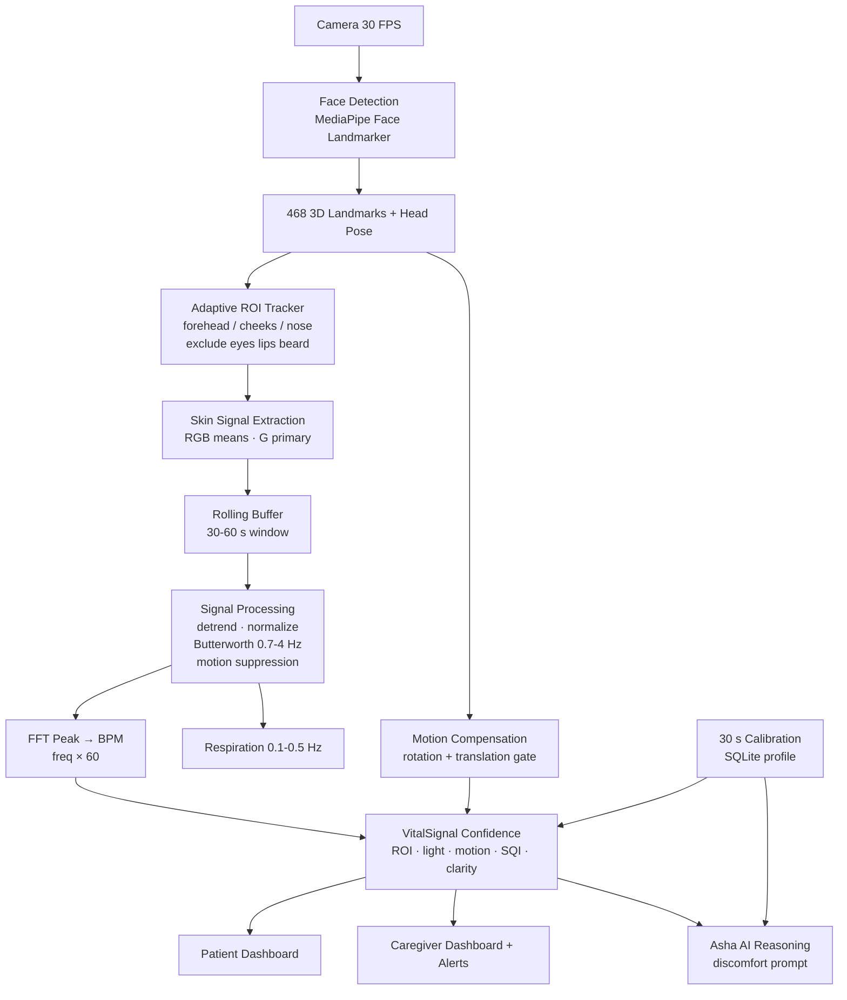

# NeuroBridge Asha VitalSense AI — System Architecture

## 1. End-to-end flow

## 2. Module map (`vitalsense/`)

| File | Responsibility | Edge equivalent |
|---|---|---|
| `roi.py` | landmark index sets, ROI fusion, stability | Kotlin/C++ MediaPipe Tasks callback |
| `signal_extractor.py` | per-frame RGB means, 30–60 s rolling buffer | ring buffer (fixed, no alloc) |
| `signal_processing.py` | detrend, normalize, Butterworth, FFT, respiration | NEON / TFLite custom op or CMSIS-DSP |
| `motion_compensation.py` | head-pose delta → 0–1 score, low/mod/high gate | same thresholds on device IMU + pose |
| `confidence.py` | weighted 0–100% + hard gates | lookup table |
| `calibration.py` | 30 s baseline → range, SQLite store | SQLite / DataStore on device |
| `asha_integration.py` | rise-persist rule, prompts, stress label | on-device rule engine |
| `pipeline.py` | `VitalSenseEngine` orchestration + waveform | foreground service |
| `api.py` | FastAPI `/api/vital/*` (optional host mount) | MethodChannel `neurobridge/vital` |

## 3. Data contracts

- Frame in: `(r, g, b, t, roi_stability, lighting, motion)` — floats.
- Reading out: `{bpm, resp_per_min, confidence 0-100, status, signal_quality,
  motion: low|moderate|high, stress, alert?}`.
- Waveform: last 6 s filtered pulse values for ECG-style canvas.

## 4. Timing budget @ 30 FPS (Raspberry Pi 4 class target)

Face mesh (TFLite GPU) ~18 ms · ROI means ~2 ms · DSP per-second batch ~5 ms ·
FFT 120-pt window ~1 ms. Total well under 33 ms/frame; DSP runs 1 Hz on window.
