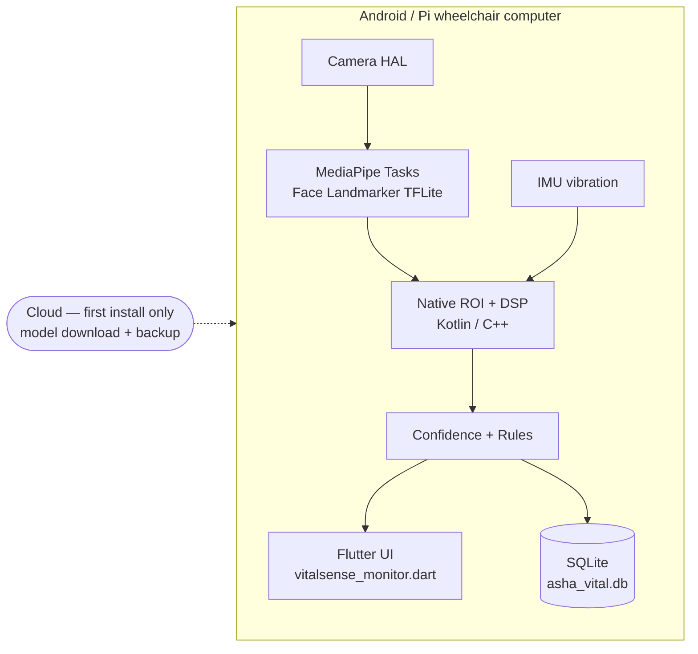

# Edge AI Deployment — VitalSense on phone / tablet / wheelchair Pi

No cloud dependency after calibration. All inference + signal DSP on device.

## Model footprint

| Artifact | Size | Runtime |
|---|---|---|
| Face Landmarker (MediaPipe Tasks, GPU delegate) | ~5 MB | TFLite / GPU |
| ROI + DSP + FFT (hand-written, no ML) | <100 KB | CPU / NEON |
| Confidence rules | <10 KB | CPU |
| Patient SQLite profile | KBs | SQLDelight / sqlite |

## Android (Kotlin) sketch

- CameraX `ImageAnalysis` 30 FPS → `FaceLandmarkerHelper` (Tasks Vision).
- JNI/Native: ROI means via RenderScript/NEON → port `signal_processing.py`
  Butterworth coefficients precomputed for fs=30, order 4, 0.7–4.0 Hz.
- `MethodChannel('neurobridge/vital')` exposes `start/reading/stop` consumed by
  `mobile/lib/vitalsense_monitor.dart`.
- ForegroundService keeps pipeline alive during wheelchair use; Doze-exempt.

## Raspberry Pi wheelchair computer

- `onnxruntime-mobile` or TFLite runtime + Pi Camera V3.
- Same Python prototype runs headless: `VitalSenseEngine` + `ProfileStore`.
- Vibration: read IMU RMS → `wheelchair_vibration_penalty()` lowers confidence.

## Calibration flow (30 s, on device)

1. Guided overlay: "hold still, face the camera".
2. Collect baseline HR FFTs → `calibrate_from_baseline()` → normal range.
3. Persist `PatientProfile` to SQLite; Asha thresholds adapt (`rise_bpm`,
   `persist_s`). Re-calibrate on lighting change or caregiver request.

## Fallbacks

Camera blocked / darkness (lighting < 0.2) → confidence ≤30, status
"Unreliable", Asha stays silent (no false alerts). High motion (>0.7) → hold
last BPM, collapse confidence, resume automatically when still.
